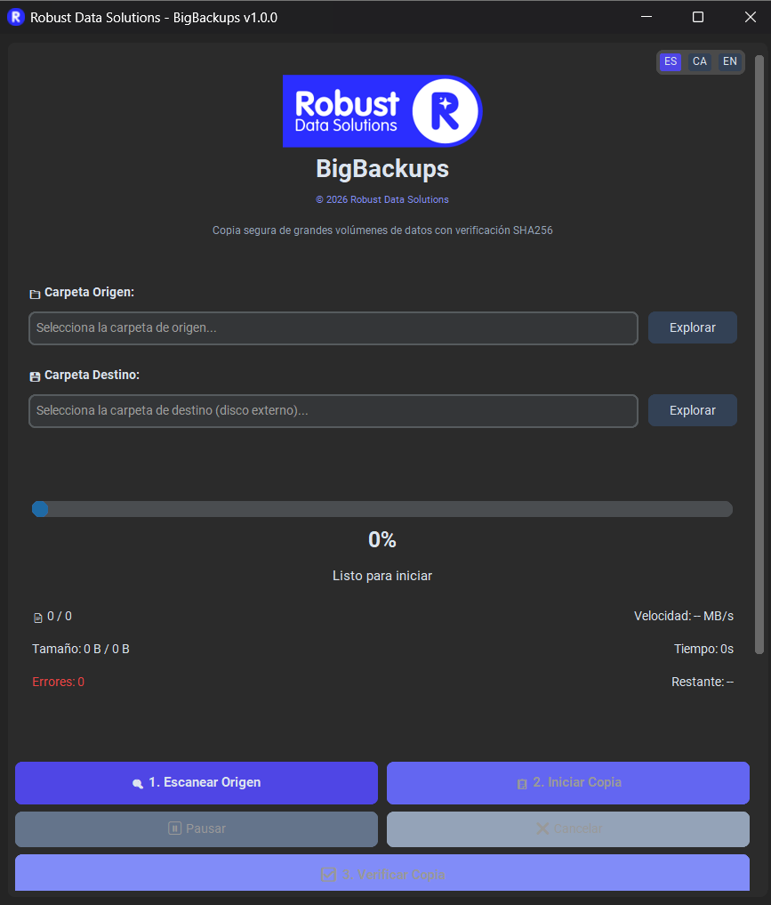
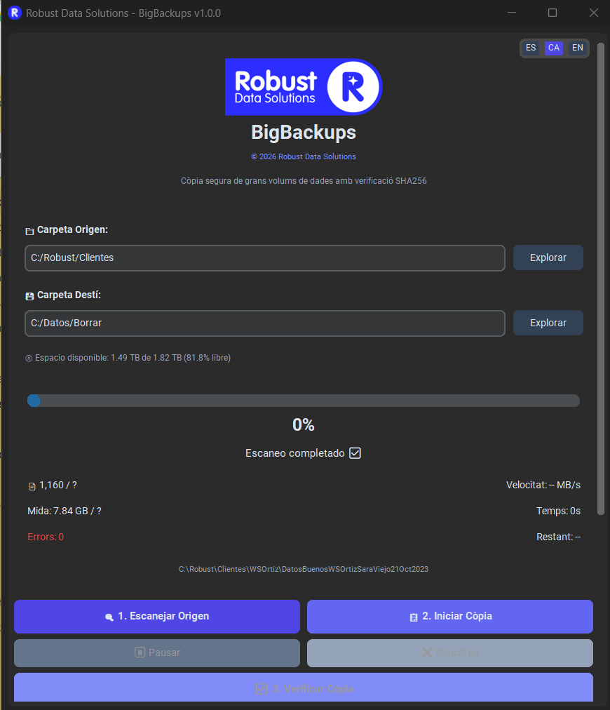
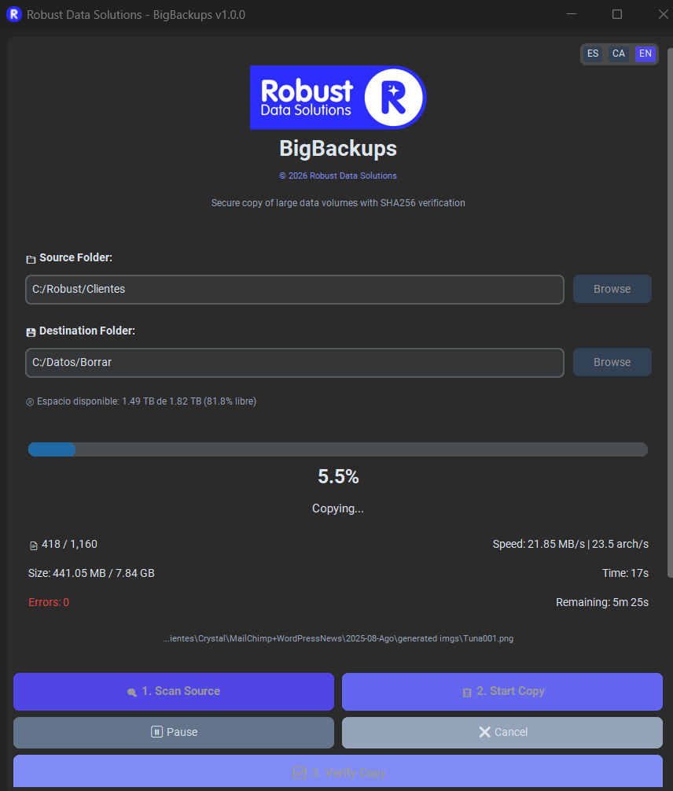
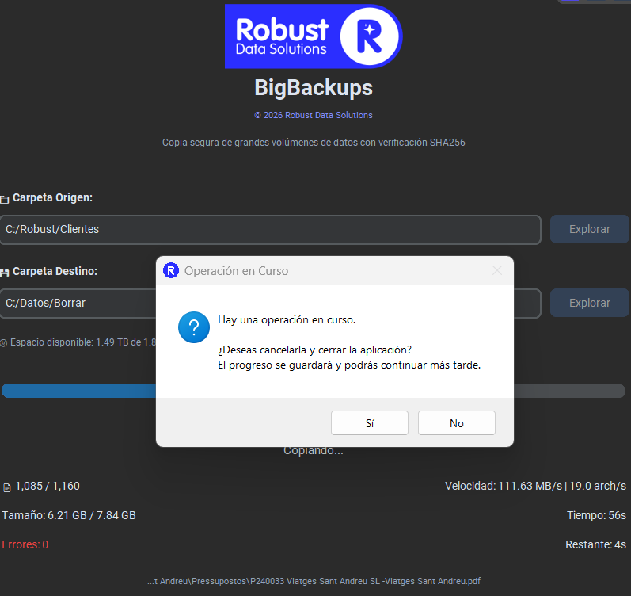
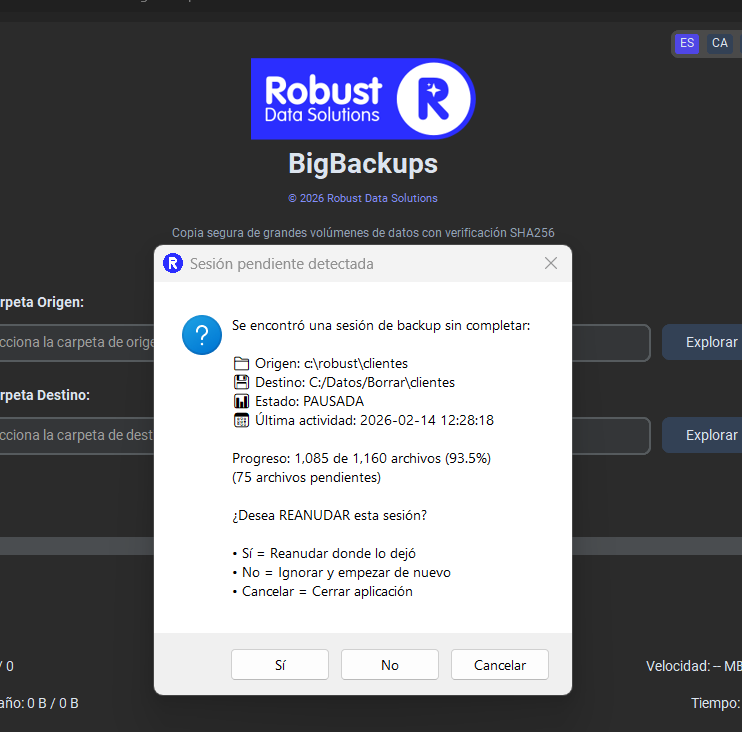
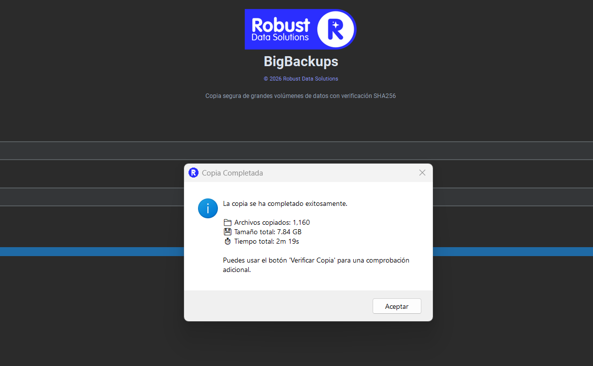
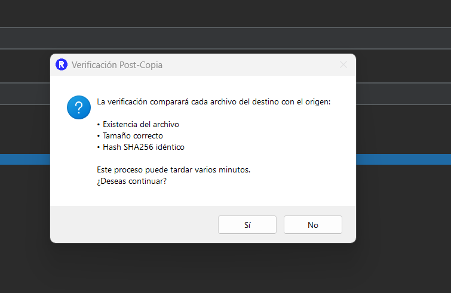
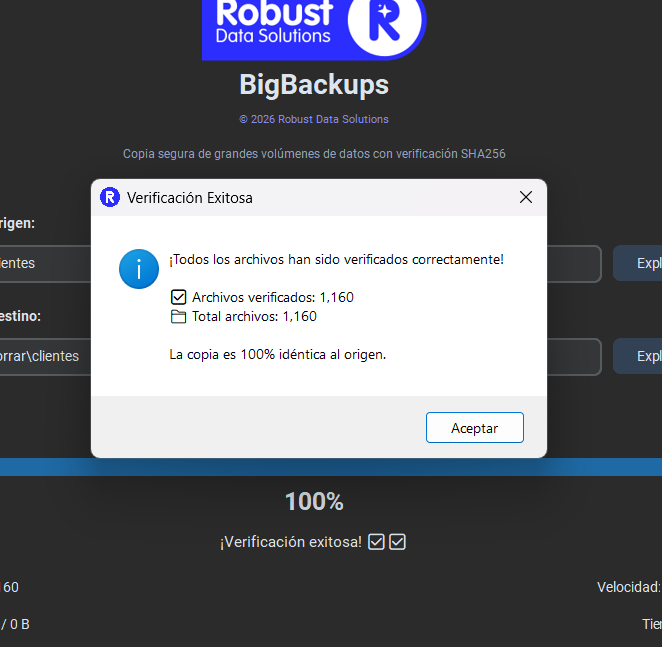

# BigBackups 🗂️

<p align="center">
  
</p>

<p align="center">
  <strong>Aplicación profesional de copia segura para grandes volúmenes de datos con verificación SHA256</strong>
</p>

<p align="center">
  Desarrollado por <a href="https://robustdatasolutions.com">Robust Data Solutions</a>
</p>

<p align="center">
  <a href="https://github.com/albertlens/bigbackups/releases/latest"></a>
  <a href="https://github.com/albertlens/bigbackups/releases/latest"></a>
  
  
  
</p>

---

## 📥 Descarga

<p align="center">
  <a href="https://github.com/albertlens/bigbackups/releases/latest">
    
  </a>
</p>

### 📚 Manuales de usuario

| Idioma | Manual PDF |
|--------|------------|
| 🇪🇸 Español | [LEEME_ES.pdf](https://github.com/albertlens/bigbackups/releases/download/v1.0.0/LEEME_ES.pdf) |
| 🇬🇧 English | [README_EN.pdf](https://github.com/albertlens/bigbackups/releases/download/v1.0.0/README_EN.pdf) |
| 🏴󠁣󠁡󠁴󠁿 Català | [LLEGEIX_CA.pdf](https://github.com/albertlens/bigbackups/releases/download/v1.0.0/LLEGEIX_CA.pdf) |

> 📖 **Documentación online:** [albertlens.github.io/bigbackups](https://albertlens.github.io/bigbackups/)

---

## 📋 Descripción

BigBackups está diseñada para copiar carpetas con miles de archivos y subcarpetas desde cualquier origen (disco local, OneDrive, carpeta de red) a un disco externo, garantizando la integridad de cada archivo mediante verificación criptográfica SHA256.

---

## 🎯 Caso de uso

Esta herramienta está pensada para:
- **Empresas** que necesitan que sus clientes copien grandes volúmenes de información a discos externos
- **Backups de OneDrive** - carpetas sincronizadas localmente
- **Copias de seguridad** desde servidores de red locales (rutas UNC)
- Cualquier situación donde se requiera una copia **verificada** y **fiable** de cientos de GB
- **Backups de larga duración** que pueden pausarse y reanudarse en múltiples sesiones/días

## ✨ Características principales

| Característica | Descripción |
|----------------|-------------|
| 🔍 **Escaneo completo** | Cataloga todos los archivos en SQLite antes de copiar |
| 🔐 **Verificación SHA256** | Cada archivo copiado se verifica con hash criptográfico |
| 📁 **Soporte rutas largas** | Maneja rutas de más de 260 caracteres en Windows |
| ☁️ **Detección OneDrive** | Identifica archivos que están solo en la nube (no descargados) |
| 🔄 **Sistema de reintentos** | Backoff exponencial ante fallos temporales de red/disco |
| ⏸️ **Pausar/Reanudar** | Continúa copias interrumpidas desde donde quedaron |
| 🔁 **Detección de sesiones** | Al reabrir la app detecta sesiones anteriores y ofrece continuarlas |
| 📋 **Log completo** | Registro detallado de todas las operaciones en DB |
| 📊 **Progreso en tiempo real** | Velocidad, tiempo restante, archivos procesados |
| 💾 **EXE portable** | Ejecutable único (~16MB), no requiere Python instalado |

---

## 🖥️ Interfaz

La aplicación cuenta con una GUI moderna y profesional con tema oscuro:

- **Header corporativo** con logo de Robust Data Solutions
- Selección de carpeta origen y destino con explorador de archivos
- Indicador de espacio disponible en disco destino
- Barra de progreso con porcentaje y estadísticas en tiempo real
- Log de eventos con scroll automático
- Botones de Pausar/Cancelar operación
- **Icono personalizado** en ventana y barra de tareas

### 📸 Capturas de pantalla

<p align="center">
  
  
</p>
<p align="center">
  
  
</p>
<p align="center">
  
  
</p>
<p align="center">
  
  
</p>

---

## 📦 Instalación

### Opción 1: Ejecutable portable (recomendado para usuarios finales)

Descarga [`BigBackups.exe`](https://github.com/albertlens/bigbackups/releases/latest) desde la sección de Releases y ejecútalo directamente. No requiere instalación.

### Opción 2: Desde código fuente (desarrollo)

#### Requisitos
- Python 3.11 o superior
- Windows 10/11

#### Dependencias

```bash
pip install -r requirements.txt
```

Dependencias principales:
- `customtkinter` - GUI moderna con tema oscuro
- `pillow` - Soporte de imágenes
- `pyinstaller` - Generación de ejecutable (solo para build)

---

## 🚀 Uso

### Modo desarrollo

```bash
python main.py
```

### Generar ejecutable (.exe)

**Opción 1: Script automatizado**
```batch
build.bat
```

**Opción 2: Manual con PyInstaller**
```bash
pip install pyinstaller
python -m PyInstaller --clean bigbackups.spec
```

El ejecutable se genera en `dist/BigBackups.exe` (~16MB, portable)

---

## 📖 Flujo de trabajo

### Flujo normal (backup nuevo)

```
┌─────────────────────────────────────────────────────┐
│  1. SELECCIONAR ORIGEN                              │
│     → Carpeta local, OneDrive o ruta de red         │
├─────────────────────────────────────────────────────┤
│  2. SELECCIONAR DESTINO                             │
│     → Disco externo USB, NAS, otra carpeta          │
├─────────────────────────────────────────────────────┤
│  3. ESCANEAR                                        │
│     → Cataloga archivos en SQLite (muy rápido)      │
│     → Muestra total de archivos y tamaño            │
├─────────────────────────────────────────────────────┤
│  4. COPIAR                                          │
│     → Crea estructura de carpetas                   │
│     → Copia cada archivo calculando SHA256          │
│     → Verifica hash del archivo copiado             │
│     → Puede pausarse en cualquier momento           │
├─────────────────────────────────────────────────────┤
│  5. VERIFICACIÓN                                    │
│     → Todos los archivos verificados con SHA256     │
│     → Errores registrados en log                    │
│     → Resumen final de la operación                 │
└─────────────────────────────────────────────────────┘
```

### Flujo de reanudación (backup interrumpido)

Si cerraste la aplicación durante una copia (pausada o no):

1. Abre BigBackups nuevamente
2. Selecciona las **mismas rutas** origen y destino
3. Haz clic en **"Escanear"**
4. La aplicación detecta la sesión anterior y pregunta:
   - **Sí**: Continuar desde donde quedó
   - **No**: Eliminar sesión anterior y empezar de nuevo
   - **Cancelar**: Abortar operación
5. Si eliges continuar, verás el progreso actual y podrás pulsar "Copiar"

---

## 🗄️ Estructura del proyecto

```
bigbackups/
├── main.py              # Punto de entrada de la aplicación
├── gui.py               # Interfaz gráfica (CustomTkinter)
├── database.py          # Gestión de SQLite (sesiones, archivos, log)
├── scanner.py           # Escaneo recursivo de directorios
├── copier.py            # Copia con verificación SHA256
├── utils.py             # Utilidades (hash, formato, detección OneDrive)
├── config.py            # Configuración global (versión, constantes)
├── requirements.txt     # Dependencias Python
├── bigbackups.spec      # Configuración de PyInstaller
├── build.bat            # Script de construcción del EXE
├── README.md            # Esta documentación
├── assets/              # Recursos gráficos
│   ├── logo.svg         # Logo vectorial (Robust Data Solutions)
│   ├── logo.png         # Logo rasterizado (180x66)
│   ├── icon.svg         # Icono vectorial (R*)
│   ├── icon.png         # Icono rasterizado (256x256)
│   └── icon.ico         # Icono Windows (multi-resolución)
└── dist/                # Ejecutable compilado
    └── BigBackups.exe   # Aplicación portable (~16MB)
```

---

## 🗃️ Base de datos

La aplicación crea `bigbackups.db` junto al ejecutable con las siguientes tablas:

### Tabla `sesiones`
Información de cada trabajo de backup:
- `id` - Identificador único
- `ruta_origen`, `ruta_destino` - Rutas de trabajo
- `estado` - (ESCANEANDO, EN_PROGRESO, PAUSADA, COMPLETADA, CANCELADA)
- `total_archivos`, `total_bytes` - Estadísticas totales
- `archivos_copiados`, `bytes_copiados` - Progreso actual
- `fecha_inicio`, `fecha_fin` - Timestamps

### Tabla `archivos`
Catálogo completo de archivos:
- `ruta_origen`, `ruta_destino` - Rutas completas
- `nombre`, `extension`, `tamano` - Metadatos
- `hash_origen`, `hash_destino` - Hashes SHA256
- `estado` - (PENDIENTE, COPIANDO, VERIFICADO, ERROR, OMITIDO)
- `intentos`, `mensaje_error` - Control de reintentos

### Tabla `carpetas`
Estructura de directorios a replicar

### Tabla `log_eventos`
Registro cronológico de todas las operaciones con timestamp

### Detección de sesiones anteriores

Al escanear, la aplicación busca sesiones previas con las mismas rutas origen/destino que no estén completadas. Esto permite:
- Reanudar backups después de cerrar la aplicación
- Continuar copias que tomaron varios días
- Evitar re-escanear archivos ya catalogados

---

## ⚙️ Configuración

El archivo `config.py` permite personalizar:

```python
# Algoritmo de hash
HASH_ALGORITHM = "sha256"  # Opciones: "md5", "sha256"

# Reintentos
MAX_RETRIES = 5
RETRY_DELAY_BASE = 2  # Segundos (backoff exponencial)

# Archivos excluidos
EXCLUDED_FILES = {"thumbs.db", "desktop.ini", ".ds_store", ...}

# Carpetas excluidas
EXCLUDED_FOLDERS = {"$recycle.bin", "system volume information", ...}
```

---

## 🛡️ Manejo de errores

| Situación | Comportamiento |
|-----------|----------------|
| Archivo bloqueado | Reintentos automáticos con espera exponencial |
| Espacio insuficiente | Alerta antes de iniciar la copia |
| Rutas muy largas | Soporte nativo con prefijo `\\?\` |
| Archivos OneDrive en nube | Se marcan como omitidos con aviso |
| Hash no coincide | Se elimina y reintenta la copia |
| Error de red | Reintentos con backoff exponencial |

---

## 📊 Rendimiento esperado

Para una copia de ~1TB con 1 millón de archivos:

| Fase | Tiempo estimado |
|------|-----------------|
| Escaneo | 5-15 minutos |
| Copia + SHA256 | 4-7 horas (depende de velocidad de discos) |

El cuello de botella es siempre la velocidad del disco, no el cálculo de hash.

---

## 🔧 Notas técnicas

- El hash SHA256 se calcula **durante** la copia (una sola lectura del archivo)
- Las inserciones en SQLite usan batch de 500 registros para rendimiento
- Compatible con rutas UNC (carpetas de red)
- SQLite usa modo WAL (Write-Ahead Logging) para mejor rendimiento
- Soporte completo de rutas largas de Windows (+260 caracteres)

---

## 📄 Licencia

MIT License - Libre para uso personal y comercial.

---

## 🏢 Desarrollado por

<p align="center">
  <a href="https://robustdatasolutions.com">
    
  </a>
</p>

<p align="center">
  <strong>Robust Data Solutions</strong><br>
  Soluciones profesionales de gestión de datos
</p>

<p align="center">
  <a href="https://robustdatasolutions.com">robustdatasolutions.com</a>
</p>
